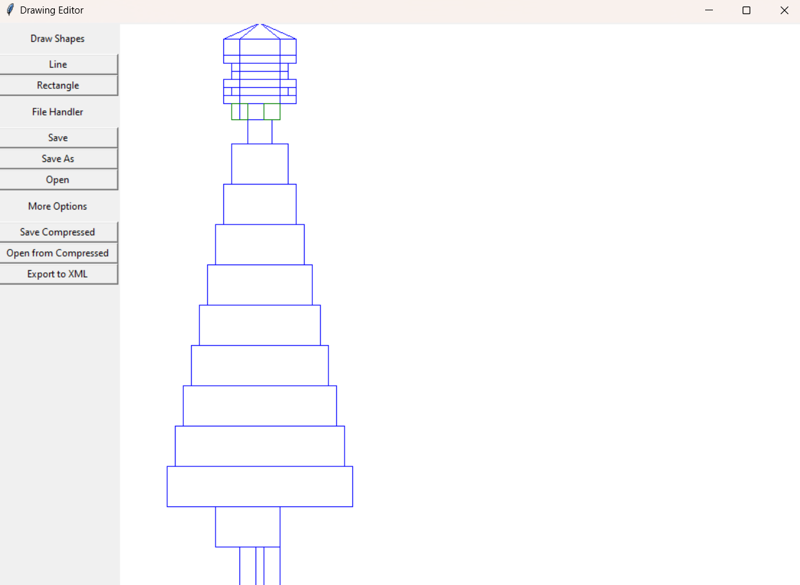
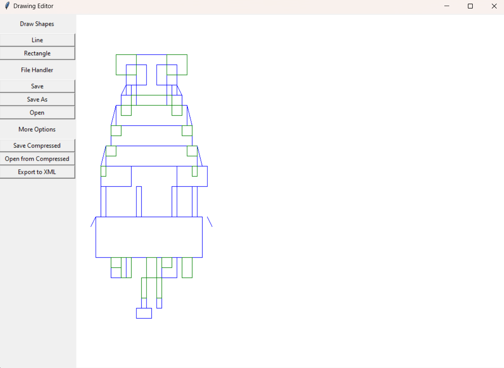

# Running the code

### Windows

`python.exe main.py`

### Unix based systems

`python3 main.py` or `python main.py`

# Requirements

Only installation needed is tkinter which can be installed using `pip install tk`

# Using 

### Make a line
Click on a line and make a line by a drag and drop operation. After making the line, the line command is no longer activated.

### Make a rectangle
Click on a rectangle and make a rectangle by a drag and drop operation. AFter making the rectangle, the line command is no longer activated.

### Select Objects
When nothing has been clicked previously the app is in the select mode and can be used to select the objects.

# Chat-GPT Generated Drawings :)
We gave Chat-GPT our ASCII format and it generated several images. These can be found in our `chatgpt_generated_drawings` folder.

## Sample of one such image generated by Chat-GPT and rendered by our application (rocket-ship)

## Sample of another image generated by Chat-GPT and rendered by our application (monkey)

